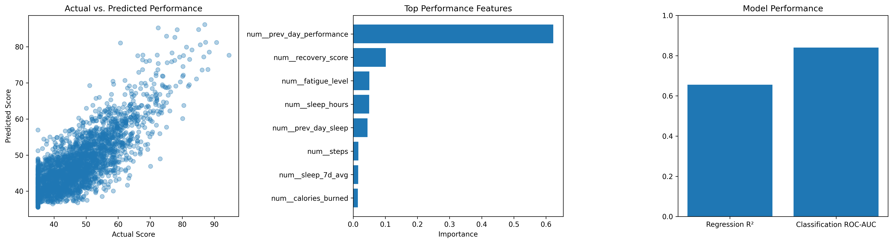

# Athlete Burnout and Performance Prediction

A machine learning project that simulates athlete training and recovery data
to identify factors related to performance and performance drops.

## Project Overview

This project generates a synthetic dataset representing 75 athletes across
180 days. The data includes workout intensity, sleep, fatigue, recovery,
soreness, hydration, and performance measurements.

The project includes:

- Data cleaning and validation
- Feature engineering
- Regression modeling for performance scores
- Classification modeling for performance drops
- Model evaluation and feature importance analysis

## Models

- Linear Regression
- Random Forest Regression
- Logistic Regression
- Random Forest Classification
- HistGradientBoosting Classification

## Results

- Random Forest regression achieved an R² score of approximately 0.656.
- HistGradientBoosting classification achieved a ROC-AUC score of approximately 0.840.
- Important performance-related features included previous-day performance,
  recovery score, fatigue level, sleep hours, and previous-day sleep.

## Results Overview

## Technologies

Python, pandas, NumPy, scikit-learn, and Matplotlib

## Important Note

The dataset used in this project is synthetically generated for demonstration
and modeling practice. The classification target represents a performance drop,
while the burnout risk score is an engineered indicator based on recovery,
fatigue, sleep, and training patterns.

